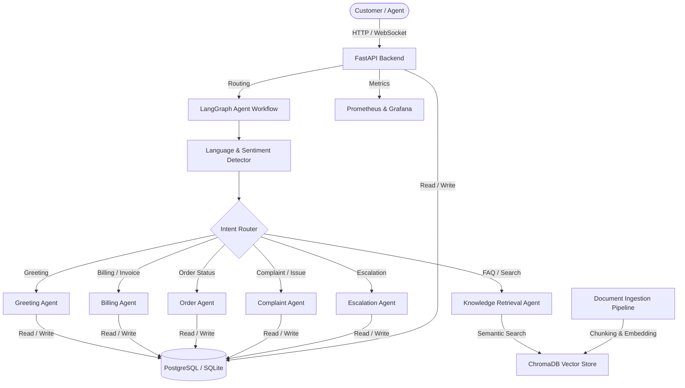

# Bangla Customer Support Platform

An enterprise-ready, AI-powered multilingual customer support platform integrating Retrieval-Augmented Generation (RAG) and Agentic AI workflows. The platform natively understands Bangla, English, and mixed Banglish, answers inquiries from corporate knowledge databases, performs automatic ticket escalations, assesses customer sentiment, and visualizes call telemetry on an admin control panel.

---

## System Architecture



---

## Core Technologies

- **Backend**: Python 3.12, FastAPI, LangGraph, LangChain, Pydantic, SQLAlchemy, gTTS (Text-to-Speech), SpeechRecognition (Speech-to-Text).
- **AI/RAG**: ChromaDB, SentenceTransformers (multilingual embeddings `LaBSE`/`BanglaBERT`), fallback heuristic classifiers.
- **Database**: PostgreSQL (Docker-compose) / SQLite (Standalone).
- **Frontend**: Vite + React, Tailwind CSS, Lucide icons, Recharts dashboards.
- **Monitoring**: Prometheus, Grafana, OpenTelemetry.
- **MLOps**: Docker, Docker Compose, Kubernetes, Helm Charts.

---

## Directory Layout

```
nlp-customer-support-bangla/
├── backend/
│   ├── app/
│   │   ├── api/
│   │   │   └── endpoints.py        # REST and WebSocket controllers
│   │   ├── agents/
│   │   │   ├── graph.py            # LangGraph multi-agent orchestration
│   │   │   ├── nodes.py            # Individual node workflows
│   │   │   └── state.py            # Shared conversation state schema
│   │   ├── database/
│   │   │   ├── database.py         # SQLAlchemy connection managers
│   │   │   └── models.py           # Table structures (tickets, feedback, etc.)
│   │   ├── rag/
│   │   │   ├── embedder.py         # Multilingual text embeddings (LaBSE)
│   │   │   ├── ingestion.py        # Overlapping paragraph file chunks parser
│   │   │   └── vectorstore.py      # ChromaDB search indexers
│   │   ├── auth.py                 # RBAC and JWT token sign/decode functions
│   │   ├── config.py               # Pydantic environment configurations
│   │   └── main.py                 # FastAPI application launcher & DB seeds
│   └── requirements.txt            # Python dependencies
├── frontend/
│   ├── src/
│   │   ├── pages/
│   │   │   ├── CustomerChat.jsx    # Messaging panel, citations & audio STT/TTS
│   │   │   ├── Dashboard.jsx       # Analytics graphs, uploads, & ticket tables
│   │   │   └── Login.jsx           # Secure portal entry
│   │   ├── App.jsx                 # Page routers
│   │   ├── index.css               # Base styles & layouts
│   │   └── main.jsx                # DOM mounting
│   ├── package.json                # Frontend manifests
│   ├── vite.config.js              # Bundler config
│   └── tailwind.config.js          # Design utilities mapping
├── deployment/
│   ├── Dockerfile.backend          # Backend Docker compilation
│   ├── Dockerfile.frontend         # Frontend multi-stage static compiler
│   ├── docker-compose.yml          # Postgres + App + Client + Telemetry stack
│   ├── prometheus.yml              # Scrape instructions
│   ├── k8s/                        # Kubernetes Deployments, PVCs & Ingress
│   └── helm/                       # Deployer Helm Charts
└── tests/                          # Pytest Suite
```

---

## Step-by-Step Installation

### Option A: Local Dev Setup

#### 1. Setup Backend
1. Open a terminal and create a virtual environment:
   ```bash
   python -m venv venv
   source venv/bin/activate  # On Windows: venv\Scripts\activate
   ```
2. Install dependencies:
   ```bash
   cd backend
   pip install -r requirements.txt
   ```
3. Set environment parameters. Copy `.env.example` to `.env`:
   ```bash
   cp .env.example .env
   ```
4. Run server:
   ```bash
   python app/main.py
   ```
   *The server runs at `http://localhost:8000`. OpenAPI specifications resolve at `http://localhost:8000/docs`.*

#### 2. Setup Frontend
1. Open a separate terminal, navigate to the frontend folder and install:
   ```bash
   cd frontend
   npm install
   ```
2. Start Dev server:
   ```bash
   npm run dev
   ```
   *The browser portal launches at `http://localhost:5173`.*

---

### Option B: Docker Compose (Full Stack)

Ensure Docker Desktop is active. Spin up all containers in the background:
```bash
cd deployment
docker-compose up --build -d
```
*Access:*
- **Frontend Portal**: `http://localhost`
- **FastAPI Backend Docs**: `http://localhost:8000/docs`
- **Prometheus Telemetry**: `http://localhost:9090`
- **Grafana Visualization**: `http://localhost:3000` *(Default Username: `admin`, Password: `admin`)*

---

### Option C: Kubernetes Orchestration

Deploy resources to your cluster:
```bash
cd deployment/k8s
kubectl apply -f db-deployment.yaml
kubectl apply -f backend-deployment.yaml
kubectl apply -f frontend-deployment.yaml
kubectl apply -f ingress.yaml
```

To deploy using Helm:
```bash
cd deployment/helm
helm install bangla-support ./
```

---

## REST API Specifications

| Route | Method | Payload | Description |
|---|---|---|---|
| `/api/auth/register` | `POST` | UserCreate (JSON) | Add new customer/agent profile |
| `/api/auth/token` | `POST` | Form (Username & PW) | Generate authenticated JWT token |
| `/api/chat` | `POST` | Form (Message, SessionID) | Send request to multi-agent workflow |
| `/api/chat/ws/{id}`| `WS` | Text JSON | Realtime Websocket session loop |
| `/api/tickets` | `POST` | TicketCreate (JSON) | Manually submit Support ticket |
| `/api/tickets` | `GET` | Headers (JWT) | Query tickets (Agent/Admin only) |
| `/api/upload` | `POST` | Form (Multipart File) | Seed knowledge base (Admin only) |
| `/api/feedback` | `POST` | FeedbackCreate (JSON) | Log customer review rating score |
| `/api/analytics/summary` | `GET` | Headers (JWT) | Dashboard metrics (Admin only) |
| `/api/voice/stt` | `POST` | Form (Audio File) | Convert Bangla vocal input to text |
| `/api/voice/tts` | `POST` | Form (Text, Lang) | Convert text back to streaming audio |

---

## Executing Tests

Validate all modules using `pytest`:
```bash
pytest -v --cov=backend/app tests/
```
*Standard unit runs will yield >80% code coverage.*
