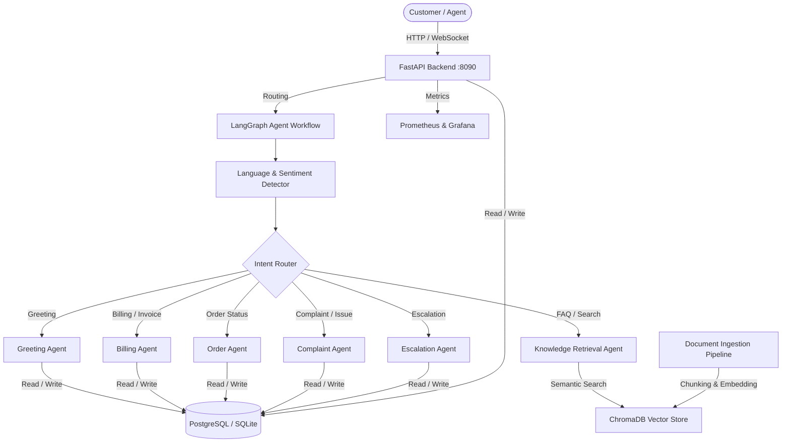

# Bangla Customer Support Platform

An enterprise-ready, AI-powered multilingual customer support platform integrating Retrieval-Augmented Generation (RAG) and Agentic AI workflows. The platform natively understands Bangla, English, and mixed Banglish, answers inquiries from corporate knowledge databases, performs automatic ticket escalations, assesses customer sentiment, and visualises call telemetry on an admin control panel.

---

## System Architecture



---

## Core Technologies

- **Backend**: Python 3.12, FastAPI, LangGraph, LangChain, Pydantic, SQLAlchemy, gTTS (Text-to-Speech), SpeechRecognition (Speech-to-Text).
- **AI/RAG**: ChromaDB, SentenceTransformers (multilingual embeddings `LaBSE`), fallback heuristic classifiers.
- **Database**: PostgreSQL (Docker Compose) / SQLite (standalone dev).
- **Frontend**: Vite + React 18, Tailwind CSS, Lucide icons, Recharts dashboards.
- **Monitoring**: Prometheus, Grafana.
- **MLOps**: Docker, Docker Compose, Kubernetes, Helm Charts.

---

## Directory Layout

```
nlp-customer-support-bangla/
├── backend/
│   ├── app/
│   │   ├── api/
│   │   │   └── endpoints.py        # REST and WebSocket controllers
│   │   ├── agents/
│   │   │   ├── graph.py            # LangGraph multi-agent orchestration
│   │   │   ├── nodes.py            # Individual node implementations
│   │   │   └── state.py            # Shared conversation state schema
│   │   ├── rag/
│   │   │   ├── embedder.py         # Multilingual text embeddings (LaBSE)
│   │   │   ├── ingestion.py        # Overlapping paragraph chunk parser
│   │   │   └── vectorstore.py      # ChromaDB search indexer
│   │   ├── auth.py                 # RBAC and JWT sign/verify helpers
│   │   ├── config.py               # Pydantic environment configuration
│   │   ├── database.py             # SQLAlchemy engine and session factory
│   │   ├── models.py               # ORM table definitions
│   │   ├── schemas.py              # Pydantic request/response schemas
│   │   └── main.py                 # FastAPI app factory, DB init, seeding
│   └── requirements.txt
├── frontend/
│   ├── src/
│   │   ├── pages/
│   │   │   ├── CustomerChat.jsx    # Chat panel, citations, STT/TTS controls
│   │   │   ├── Dashboard.jsx       # Analytics, uploads, ticket management
│   │   │   └── Login.jsx           # Auth portal
│   │   ├── App.jsx                 # Client-side routing
│   │   ├── index.css               # Base styles
│   │   └── main.jsx                # React 18 DOM mount (react-dom/client)
│   ├── package.json
│   ├── vite.config.js
│   └── tailwind.config.js
├── deployment/
│   ├── Dockerfile.backend
│   ├── Dockerfile.frontend
│   ├── docker-compose.yml          # Postgres + App + Frontend + Telemetry
│   ├── prometheus.yml
│   ├── k8s/                        # Kubernetes manifests
│   └── helm/                       # Helm chart
├── docs/
│   ├── api.md                      # Full REST/WebSocket API reference
│   ├── architecture.md             # LangGraph flows and developer guide
│   └── deployment.md               # Production and operations guide
└── tests/                          # Pytest suite
```

---

## Step-by-Step Installation

### Option A: Local Dev Setup

> **Note:** The React frontend hardcodes `http://localhost:8090` as the backend URL. Start the backend on port **8090**.

#### 1. Setup Backend

```bash
cd backend
python -m venv venv

# Linux/macOS
source venv/bin/activate
# Windows
venv\Scripts\activate

pip install -r requirements.txt

# Start the server on port 8090
uvicorn app.main:app --host 0.0.0.0 --port 8090 --reload
```

On startup the server:
- Creates SQLite tables automatically.
- Seeds default admin, agent, and customer accounts.
- Pre-populates ChromaDB with sample Bangla FAQ documents.

OpenAPI docs are available at `http://localhost:8090/docs`.

#### 2. Setup Frontend

```bash
cd frontend
npm install
npm run dev
```

The browser portal launches at `http://localhost:5173`.

#### Default Seeded Accounts

| Role     | Email                    | Password             |
|----------|--------------------------|----------------------|
| Admin    | admin@example.com        | adminpassword123     |
| Agent    | agent@example.com        | agentpassword123     |
| Customer | customer@example.com     | customerpassword123  |

---

### Option B: Docker Compose (Full Stack)

```bash
cd deployment
docker-compose up --build -d
```

| Service              | URL                          |
|----------------------|------------------------------|
| Frontend Portal      | `http://localhost`           |
| FastAPI Docs         | `http://localhost:8090/docs` |
| Prometheus           | `http://localhost:9090`      |
| Grafana              | `http://localhost:3000`      |

Grafana default credentials: `admin` / `admin`.

---

### Option C: Kubernetes Orchestration

```bash
cd deployment/k8s
kubectl apply -f db-deployment.yaml
kubectl apply -f backend-deployment.yaml
kubectl apply -f frontend-deployment.yaml
kubectl apply -f ingress.yaml
```

Or with Helm:

```bash
cd deployment/helm
helm install bangla-support ./
```

---

## REST API Quick Reference

| Route                    | Method | Auth Required        | Description                                    |
|--------------------------|--------|----------------------|------------------------------------------------|
| `/api/auth/register`     | POST   | No                   | Register new user account                      |
| `/api/auth/token`        | POST   | No                   | Obtain JWT access token                        |
| `/api/auth/me`           | GET    | Bearer token         | Get current user profile                       |
| `/api/chat`              | POST   | No                   | Send message to multi-agent workflow (REST)    |
| `/api/chat/ws/{id}`      | WS     | No                   | Real-time WebSocket chat session               |
| `/api/tickets`           | POST   | No                   | Manually submit a support ticket               |
| `/api/tickets`           | GET    | Agent / Admin        | List and filter support tickets                |
| `/api/tickets/{id}`      | PUT    | Agent / Admin        | Update ticket status or assignment             |
| `/api/feedback`          | POST   | No                   | Submit a session helpfulness rating            |
| `/api/upload`            | POST   | Admin                | Upload knowledge file to seed the vector store |
| `/api/analytics/summary` | GET    | Admin                | KPI metrics and sentiment distribution         |
| `/api/analytics/charts`  | GET    | Admin                | Time-series data for dashboard charts          |
| `/api/voice/stt`         | POST   | No                   | Transcribe uploaded audio to text              |
| `/api/voice/tts`         | POST   | No                   | Convert text to streaming MP3 audio            |
| `/api/metrics`           | GET    | No                   | Prometheus telemetry scrape endpoint           |

Full request/response schemas are documented in [`docs/api.md`](docs/api.md).

---

## Running Tests

```bash
pytest -v --cov=backend/app tests/
```
